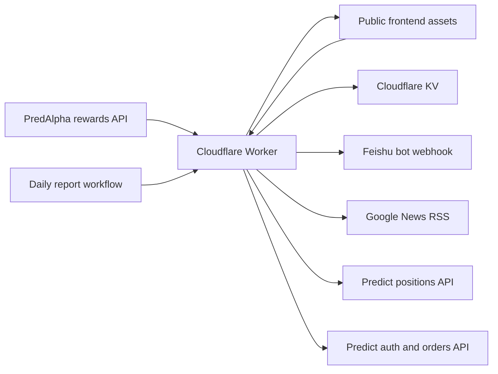

# Architecture

## System Overview

Predict Rewards Monitor has three runtime surfaces:

1. Public Cloudflare Worker site for frontend assets, API routes, favorites, wallet monitoring, and reports.
2. Local development server for proxying live rewards data.
3. Predict APIs for positions, wallet auth, open orders, and market metadata.



## Frontend

Files:

- `public/index.html`: page shell.
- `public/app.mjs`: rendering, UI state, favorite actions, and manual report trigger.
- `public/rewards-core.mjs`: shared rewards helpers and pure market logic.
- `public/wallet-core.mjs`: wallet address validation, position/order summaries, and market favorite conversion.
- `public/styles.css`: visual layout.

Production data path:

- On the Worker site, `public/app.mjs` reads same-origin `data/rewards.json`, which the Worker proxies live from PredAlpha.
- On `localhost`, `public/app.mjs` reads `/api/markets/rewards`.
- On `file://`, it reads the PredAlpha API directly.

The frontend fully rerenders on state changes. To avoid losing user context, `renderPage()` captures and restores:

- focused element id,
- search selection range,
- window scroll position,
- market table scroll position.

## Local Server

`server.mjs` serves static files from `public/` and proxies:

```text
GET /api/markets/rewards
```

The proxy forwards `PREDALPHA_API_KEY` as `x-api-key` when the variable is set. It keeps a 15 second in-memory response cache.

## Worker

Worker entrypoint: `worker/index.mjs`

Configured by `wrangler.toml`:

```toml
name = "predict-favorites"
main = "worker/index.mjs"
workers_dev = true

[vars]
SITE_ACCESS_MODE = "public"

[assets]
directory = "./public"
binding = "ASSETS"
run_worker_first = true
```

KV namespace:

- Binding: `FAVORITES`
- Production id: `0e28a446d5f1460489ca5a7a8400a133`

Routes:

| Method | Path | Purpose |
| --- | --- | --- |
| `GET` | `/health` | Health check. |
| `POST` | `/api/site/login` | Validate `SITE_PASSWORD` and issue a seven-day signed HttpOnly cookie. |
| `POST` | `/api/site/logout` | Clear the site session cookie. |
| `GET` | `/api/site/status` | Return whether the site is public and whether the current request is authenticated. |
| `GET` | `/api/favorites` | Return all favorite markets. |
| `POST` | `/api/favorites` | Upsert one favorite market. |
| `DELETE` | `/api/favorites/:key` | Remove one favorite market. |
| `POST` | `/api/report/send` | Build and send the current favorite-market report to Feishu. |
| `GET` | `/api/predict-auth/status` | Return whether a Predict JWT is stored, plus the login signer and Predict account address when known. |
| `GET` | `/api/predict-auth/message` | Proxy the official Predict auth message. |
| `POST` | `/api/predict-auth/token` | Exchange a wallet signature for a Predict JWT and store it encrypted in KV. |
| `GET` | `/api/markets/:id/orderbook` | Proxy Predict market orderbook data for Activate Points depth calculations. |
| `GET` | `/api/wallets` | Return monitored wallet addresses. |
| `POST` | `/api/wallets` | Add one monitored wallet address. |
| `DELETE` | `/api/wallets/:address` | Remove one monitored wallet address. |
| `GET` | `/api/wallets/summary` | Fetch monitored wallet positions and auto-merge position markets into favorites. |
| `GET` | `/api/wallets/me/orders` | Fetch authenticated self-wallet open orders and auto-merge their markets into favorites. |

Production sets `SITE_ACCESS_MODE = "public"`, so static assets and normal site APIs do not require a password session. Browser write routes still enforce allowed origins. If `SITE_ACCESS_MODE` is removed or set to any other value, all API routes except `/health`, `/api/site/login`, `/api/site/logout`, `/api/site/status`, and token-authorized `/api/report/send` require a valid site session cookie, and static assets are served only after this check.

## Data Model

KV key: `favorites:v1`

Value shape:

```json
[
  {
    "id": "32279",
    "key": "32279",
    "title": "Will Hylo launch a token by June 30, 2026?",
    "question": "Will Hylo launch a token by June 30, 2026?",
    "categorySlug": "will-hylo-launch-a-token-by",
    "yesBid": 0.056,
    "noBid": 0.942,
    "expiresAtSec": 1798794000,
    "url": "https://predict.fun/market/will-hylo-launch-a-token-by"
  }
]
```

KV key: `report:price-state:v1`

Value shape:

```json
{
  "generatedAt": "2026-05-19T02:00:00.000Z",
  "markets": {
    "32279": {
      "yesBid": 0.056,
      "noBid": 0.942
    }
  }
}
```

KV key: `wallets:v1`

Value shape:

```json
[
  "0x742d35cc6634c0532925a3b844bc454e4438f44e"
]
```

KV key: `predict:auth:v1`

Value shape: encrypted JSON created by the Worker. The plaintext contains the login signer address, the connected Predict account address, the Predict JWT, and the save timestamp. The plaintext value must not be logged or committed.

## Report Generation

Shared report helpers live in `scripts/report-core.mjs`.

The Worker report flow:

1. Read favorites from KV.
2. Fetch current rewards markets from `https://api.predalpha.xyz/api/markets/rewards`.
3. Read the previous price snapshot from KV.
4. Build price rows with latest Yes/No prices and deltas.
5. Search Google News RSS for event progress within a 48 hour window.
6. Send a signed interactive card to Feishu.
7. Store a new price snapshot in KV.

The report has two sections:

- Price changes: latest Yes/No and delta from the previous snapshot.
- Event progress: matching news item or `无进展`.

## Activate Points Orderbooks

The rewards table hides the raw minimum-share threshold but still uses it for filtering. The frontend fetches each market's orderbook through `GET /api/markets/:id/orderbook`, which proxies `GET https://api.predict.fun/v1/markets/{id}/orderbook` with Worker secret `PREDICT_API_KEY`.

Shared orderbook filtering logic lives in `public/orderbook-core.mjs`.

For each market:

1. Read `spreadThreshold`, `shareThreshold`, and `tick` from the PredAlpha rewards row.
2. Read top-of-book `bids` and `asks` from Predict. These are Yes-side aggregated price levels in `[price, quantity]` format.
3. Check whether `bestAsk - bestBid <= spreadThreshold`.
4. Keep the top five bids plus top five asks whose aggregated quantity meets `shareThreshold`.
5. Sum those active bid/ask quantities and render the total in the market table.
6. Expand the row to show active bid/ask Yes prices and quantities, with green bid bars and red ask bars scaled by quantity.

The count is an eligible aggregated quantity total, not an individual-order count. Predict's public orderbook endpoint does not expose maker addresses, order hashes, or order age, so the UI cannot verify the five-minute active-order requirement.

## Wallet Monitoring

The wallet monitor page is backed by Worker routes. Addresses are normalized to lowercase EVM addresses before storage.

`GET /api/wallets/summary`:

1. Reads `wallets:v1` from KV.
2. Fetches `GET https://api.predict.fun/v1/positions/{address}` for each address with Worker secret `PREDICT_API_KEY`.
3. Converts returned positions into display rows.
4. Converts each position market into a favorite-market candidate.
5. Merges candidates into `favorites:v1` without duplicating existing keys.

Self-wallet open-order flow:

1. Browser asks the selected injected wallet to connect.
2. Browser fetches `GET /api/predict-auth/message`.
3. Browser requests `personal_sign` for the official Predict login message.
4. Browser posts signer, message, and signature to `POST /api/predict-auth/token`.
5. Worker exchanges the signature for a Predict JWT.
6. Worker calls `GET https://api.predict.fun/v1/account` with the JWT and reads the connected Predict account address.
7. Worker stores signer, Predict account address, and JWT encrypted in `predict:auth:v1`.
8. Worker adds the Predict account address, not the login wallet address, to `wallets:v1` so positions are read from the internal wallet.
9. `GET /api/wallets/me/orders` calls `GET https://api.predict.fun/v1/orders?status=OPEN` with the stored JWT.
10. Worker fetches market metadata for each order, renders display rows, and auto-merges order markets into favorites.

Arbitrary-address open orders are still not fetched. Predict's documented `GET /v1/orders` endpoint lists the authenticated user's own orders and requires JWT authentication.

Some Predict logins, especially third-party wallet logins that create a Predict-hosted internal wallet, may return the login wallet address from `/v1/account` instead of the internal wallet where positions live. In that case, position monitoring can still work by manually adding the internal wallet address to `wallets:v1`, but current open-order monitoring remains limited to the account represented by the stored Predict JWT.

## Deployment

Cloudflare Worker workflow:

- File: `.github/workflows/cloudflare-worker.yml`
- Runs on push when Worker-related files change, or manual dispatch.
- Sets Worker secrets from GitHub Secrets, then runs `wrangler deploy`.
- Deploys `public/` as Workers static assets.

Daily report workflow:

- File: `.github/workflows/daily-report.yml`
- Runs at 10:00 Asia/Shanghai.
- Calls `POST https://predict-favorites.aihuman750.workers.dev/api/report/send`.
